#################################################
AN01234: Creating a local dictionary with Sensory
#################################################

************
Introduction
************

Before getting started, ensure that you have the latest versions of CMake, a Python 3 installation with pip, git, a github account with ssh cloning keys set up, and a visual studio command prompt.

***********
Get SDK
***********

First, let’s make sure we can build the default “hello XMOS” example from scratch:

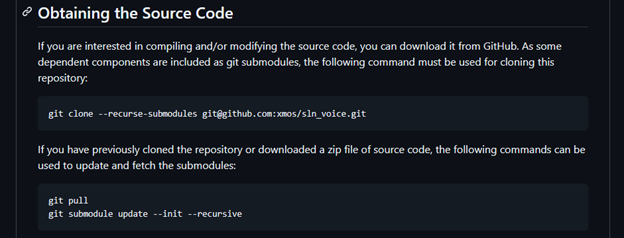

Follow the cloning instructions from https://github.com/xmos/sln_voice/

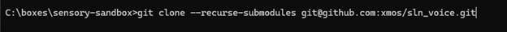

*emphasis* Note: clone to a directory that is near C:\ to avoid path length issues, the clone will take 3-5 minutes

Now we have the code we need and some pre-loaded Sensory models.

****************
Build Host Tools
****************

Next, follow the instructions at https://github.com/xmos/sln_voice/tree/develop/examples/ffd
(for more details see: https://www.xmos.com/documentation/XM-014785-PC/html/doc/programming_guide/ffd/deploying/native_windows.html#building-the-host-applications )

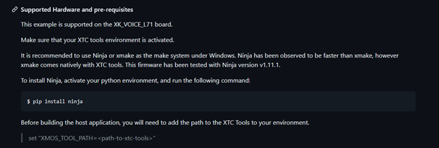

If you already have Ninja installed, you will see something like this:

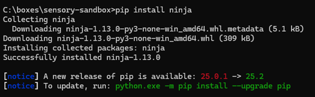

Set up the XMOS tools in a visual studio command prompt (this will allow you to build the host tools and the eventual binaries from the same prompt):

*emphasis* Note: the x64 Native Tools Command Prompt is required for linking with the 64 bit XTC 15.3.1 binaries. Older version of the tools may have required a 32-bit developer command prompt.

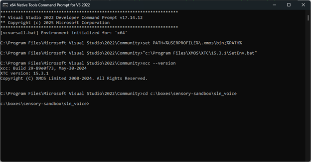

Now you are ready to build the host tools, these are essential for making your own speech recognition application as it will create several executables that are used for setting up the flash storage, navigate to the sln_voice folder and run the following:

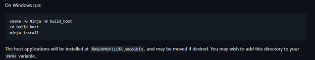

Here is the tail of the expected output of the initial call to cmake (these warnings are safe to ignore):

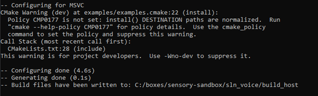

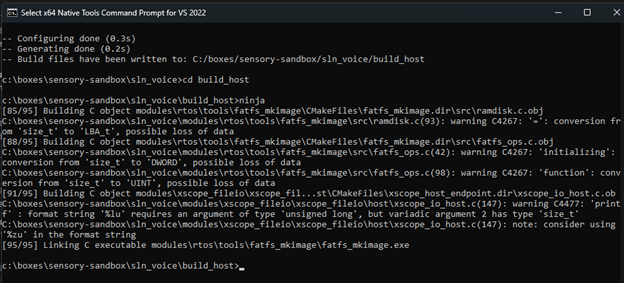

To check that PATH was updated correctly, you can try:

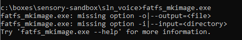

If you do not see this output, double check your steps from this section and/or edit the system path through system properties -> environment variables -> path.

**************
Build Binaries
**************

For this section, replace any occurrence of “<speech engine>” with “sensory”
Navigate back to the project root directory, this is one level up from build_host, and follow these steps:

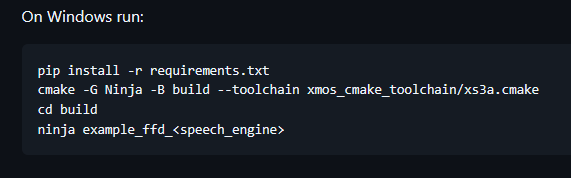

These warnings are safe to ignore:

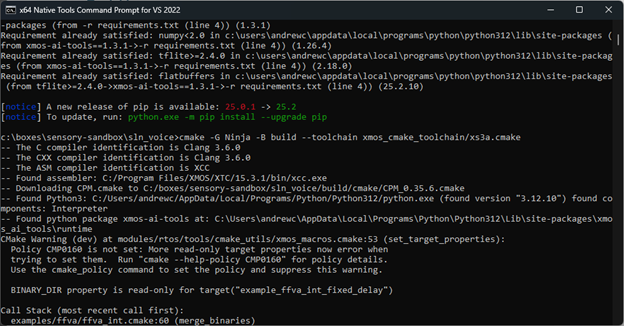

And a successful configuration will look like this:

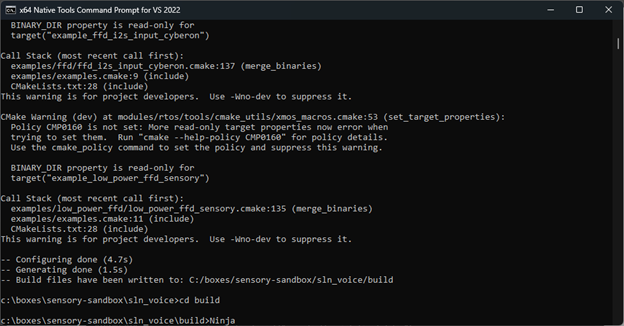

Ninja may take up to 5 minutes on an initial/clean build.

********************
Flash Board and Test
********************

Plug in both the board and the XTAG to a USB hub (or two USB ports on the same computer) and make sure the ribbon cable connecting them is firmly connected on both ends.

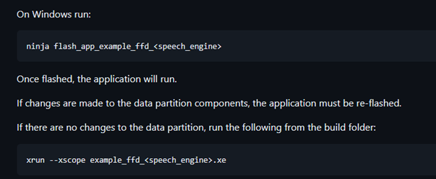

You should start seeing “site 0 write” after a few minutes, wait for this to finish (several minutes).
Saying “hello XMOS” should turn the green blinking LED to red, if you plug in a speaker or earphones you should hear a sound when you say hello XMOS, a second sound will tell you that the device has timed out and stopped listening.
Try:
“hello XMOS”
“volume up”
You should hear “volume increased”

***************************
Create custom Sensory Model
***************************

Log into https://voicehub.sensory.com with your account to start a new command project.  It is recommended that you include the wake word as a line in the command set instead of its own project.  This is due to the memory size considerations with the XU316.
In the Command Project window select the appropriate SDK Version.  Wake Word should be “<None>”.  The Initial Size should be limited to 256 KB.  Output format should be “THF-Micro 7.1.0+: Generic (pc60w / pc62w)”.

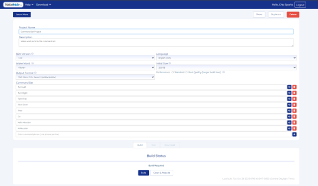

After building and testing, download the compressed model folder.  

*******************************************
Update files, handlers, and rebuild project
*******************************************
1.	Copy the following files in your zip to english_usa folder
  a.	command.snsr 
  b.	command-pc62w-6.4.0-op21-dev-search.c 
  c.	command-pc62w-6.4.0-op21-dev-net.c 
  d.	command-pc62w-6.4.0-op21-dev-search.h 
  e.	command-pc62w-6.4.0-op21-dev-search.bin 
  f.	command-pc62w-6.4.0-op21-dev-net.bin 
2.	Edit examples\ffd\ffd_sensory.cmake
  a.	set(SENSORY_COMMAND_SEARCH_HEADER_FILE "${FFD_SRC_ROOT}/model/${MODEL_LANGUAGE}/command-pc62w-6.4.0-op21-dev-search.h")
  b.	set(SENSORY_COMMAND_SEARCH_SOURCE_FILE "${FFD_SRC_ROOT}/model/${MODEL_LANGUAGE}/command-pc62w-6.4.0-op21-dev-search.c")
  c.	set(SENSORY_COMMAND_NET_FILE "${FFD_SRC_ROOT}/model/${MODEL_LANGUAGE}/command-pc62w-6.4.0-op21-dev-net.bin.nibble_swapped")
3.	Edit examples\ffd\model\english_usa\command-pc62w-6.4.0-op21-dev-search.h
  a.	Line23: extern const unsigned short gs_grammarLabel[];
4.	Edit examples\ffd\model\english_usa\command-pc62w-6.4.0-op21-dev-search.c
  a.	Comment Line 31
  b.	Line 32: const unsigned short gs_grammarLabel[] ALIGNED(4) = {
5.	Open terminal in folder sln_voice_raw_for_sensory/examples/ffd/model/english_usa
6.	Run
  a.	nibble_swap command-pc62w-6.4.0-op21-dev-net.bin
    command-pc62w-6.4.0-op21-dev-net.bin.nibble_swapped

7.	Connect your computer with L71 board and XTAG
8.	Open terminal in folder sln_voice
9.	Run
  a.	cmake -G Ninja -B build --toolchain=xmos_cmake_toolchain/xs3a.cmake
  b.	cd build
  c.	ninja flash_app_example_ffd_sensory
  d.	xrun --xscope ./example_ffd_sensory.xe
10.	Now say the command set, you should see the following message sent through xscope

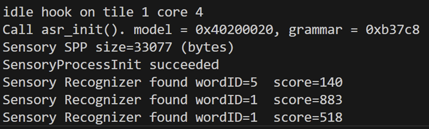

To make the responses match your commands you can modify the following source files:

modules/asr/intent_engine/intent_engine_io.c

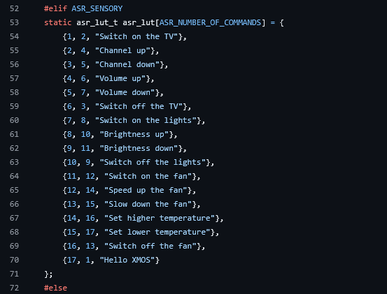

modules/asr/intent_engine/intent_engine.c

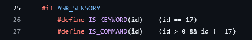

*may need to change ID based on number of commands

If you do want audio files to play back you can modify this file:
modules/asr/intent_handler/audio_response/audio_response.c
and put your wav files here:
examples/ffd/filesystem_support/english_usa
(these will get digested by the build and added to the flash filesystem).  The audio files should be 16-bit, 16KHz, mono format wav files.
*emphasis* Keep in mind that both working memory and flash storage are limited, so large amounts of audio data and/or sensory models with many commands may not fit.

********************
Flash board and test
********************

Repeat the steps from the default XMOS model, you should be using your own wake word and commands to test now.

Building the example
====================

This section assumes that the `XMOS XTC Tools <https://www.xmos.com/software-tools/>`_ have been
downloaded and installed. The required version is specified in the accompanying ``README``.

Installation instructions can be found `here <https://xmos.com/xtc-install-guide>`_.

Special attention should be paid to the section on
`Installation of Required Third-Party Tools <https://www.xmos.com/documentation/XM-014363-PC/html/installation/install-configure/install-tools/install_prerequisites.html>`_.

The application is built using the `xcommon-cmake <https://www.xmos.com/file/xcommon-cmake-documentation/?version=latest>`_
build system, which is provided with the XTC tools and is based on `CMake <https://cmake.org/>`_.

The ``an01234`` software ZIP package should be downloaded and extracted to a chosen working
directory.

To configure the build, the following commands should be run from an XTC command prompt::

    cd an01234
    cd app_an01234
    cmake -G "Unix Makefiles" -B build

All required dependencies are included in the software package. If any dependencies are missing,
they will be retrieved automatically during this step.

The application binaries should then be built using ``xmake``::

    xmake -j -C build

Binary artifacts (.xe files) will be generated under the appropriate subdirectories of the
``app_an01234/bin`` directory — one for each supported build configuration.

For subsequent builds, the ``cmake`` step may be omitted.
If ``CMakeLists.txt`` or other build files are modified, ``cmake`` will be re-run automatically
by ``xmake`` as needed.

Running the example
===================

From an XTC command prompt, the following command should be run from the ``an01234/app_an01234``
directory::

    xrun ./bin/app_an01234.xe

Alternatively, the application can be programmed into flash memory for standalone execution::

    xflash ./bin/app_an01234.xe

|newpage|

.. _further_reading:

***************
Further reading
***************

* `XMOS` XTC Tools Installation Guide

  https://www.xmos.com/xtc-install-guide

* `XMOS` XTC Tools User Guide

  https://www.xmos.com/view/Tools-15-Documentation

* `XMOS` application build and dependency management system; `xcommon-cmake`

  https://www.xmos.com/file/xcommon-cmake-documentation/?version=latest
